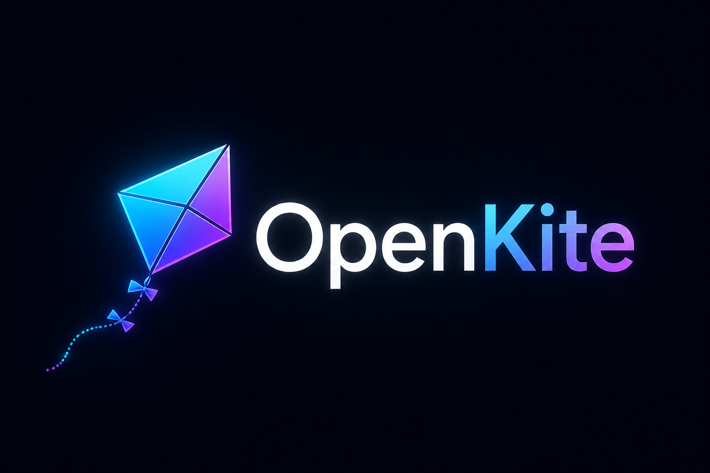
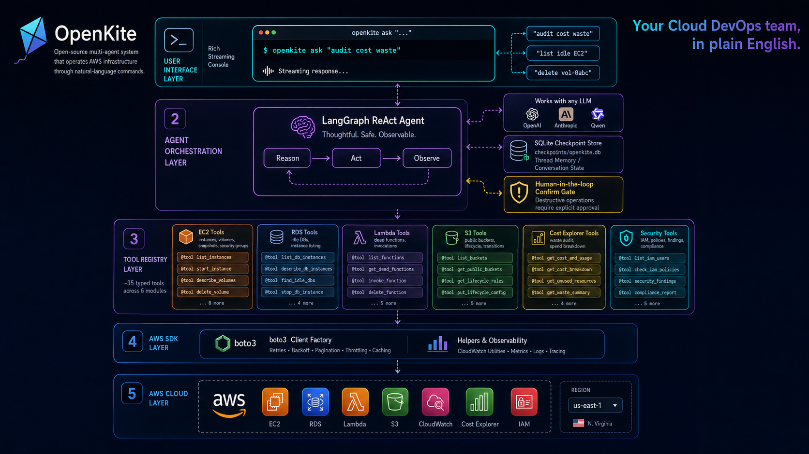

<div align="center">



**Opensource Infra AI Agent**

**An opensource Multi-Agent system that works like your Cloud DevOps team. Give commands, audit costs and analyze your AWS Infrastructure in plain english.**

[](https://github.com/darshil3011/openkite/stargazers)
[](LICENSE)
[](https://www.python.org/)
[](https://linkedin.com/in/darshil3011)

[Quickstart](#quickstart) · [Examples](#examples) · [Toolbox](#toolbox) · [Contributing](#contributing)

</div>

---

<p align="center">
  
</p>

---

## Why OpenKite

OpenKite collapses your entire DevOps console into a single chat prompt. Instead of jumping between the AWS console, Cost Explorer dashboards, CloudWatch tabs, Trusted Advisor, custom Bash scripts, and a folder of Terraform one-offs — you just *ask*.

It does the work a DevOps engineer would do, on demand:

- **Inventory & visibility** — list, filter, and inspect EC2, RDS, Lambda, S3, NAT, security groups across regions without touching the console.
- **Cost optimization** — audit idle compute, orphan EBS, dead Lambdas, lifecycle-less buckets, idle NAT gateways and underused reservations — the same hunt a FinOps engineer runs every quarter.
- **Security & compliance checks** — flag wide-open security groups and public S3 buckets in seconds, no Trusted Advisor subscription needed.
- **Performance triage** — pull CloudWatch metrics for any resource (`is i-… idle?`, `RDS CPU last 14 days?`) without writing a single boto3 call.
- **Safe remediation** — stop instances, delete orphan volumes, attach S3 lifecycle rules, retire dead Lambdas — every write action pauses for human approval before it runs.
- **Conversational follow-ups** — *"now delete the smallest one"* — threads remember context across turns, just like a teammate would.

One agent. ~30 typed tools. Plain English in, real AWS actions out — with humans in the loop where it matters.

## Quickstart

### 1. Install

```bash
git clone https://github.com/darshil3011/openkite.git
cd openkite
python3 -m venv .venv
source .venv/bin/activate
pip install -e ".[dev]"
```

### 2. Add your API keys

OpenKite needs **AWS credentials** for the tools and **one LLM provider key** for the agent. Anthropic is the default — pick anything else from [Choose your LLM provider](#choose-your-llm-provider) below.

```bash
# AWS (read-only IAM user is recommended for safety)
export AWS_ACCESS_KEY_ID=AKIA...
export AWS_SECRET_ACCESS_KEY=...
export AWS_DEFAULT_REGION=us-east-1

# Default LLM: Anthropic Claude (https://console.anthropic.com/)
export ANTHROPIC_API_KEY=sk-ant-...
```

Append these to `~/.bashrc` (or `~/.zshrc`) and `source` it to make them persistent. Boto3 and the LangChain provider pick up env vars automatically.

If you already use AWS profiles, set `AWS_PROFILE=my-readonly-profile` instead of the two key/secret vars.

### 3. Use it

```bash
openkite ask "list my running EC2 instances"
openkite ask "is i-03e3c90cd9ea52c82 idle?"
openkite ask "audit my AWS for cost waste"
openkite ask "show me public S3 buckets"
openkite ask "delete volume vol-0abc"          # pauses to confirm
```

Browse the toolbox:

```bash
openkite tools
```

## Examples

### Targeted question — one LLM call, one boto3 call

```
$ openkite ask "is i-03e3c90cd9ea52c82 idle?"

→ get_ec2_metric(instance_id='i-03e3c90cd9ea52c82', days=14)
   {"average": 0.3, "metric": "CPUUtilization"}

Yes — the instance averaged 0.3% CPU over 14 days. It is idle.
```

### Broad audit — analyzers fan out in parallel

```
$ openkite ask "audit cost waste in us-east-1"

→ find_idle_ec2(region='us-east-1')
→ find_orphan_ebs(region='us-east-1')
→ find_dead_lambda(region='us-east-1')
→ find_buckets_without_lifecycle(region='us-east-1')
→ find_idle_nat_gateways(region='us-east-1')

Found 11 candidates totalling ~$143/mo:
- 4 idle EC2 instances (proxy, wc-admin-test, wc-admin-prod, ...)
- 1 idle RDS (wc-admin-prod)
- 6 unmanaged S3 buckets
```

### Write action — paused for human approval

```
$ openkite ask "delete vol-0abc1234"

→ delete_volume(volume_id='vol-0abc1234')

[confirm] Delete EBS volume vol-0abc1234 in us-east-1?  (yes/no): yes

   {"volume_id": "vol-0abc1234", "status": "deleted"}

Done — the volume has been deleted.
```

### Follow-up questions on the same thread

```bash
openkite ask "list orphan EBS volumes" --thread my-cleanup
openkite ask "delete the smallest one" --thread my-cleanup    # remembers the list
```

## Toolbox

31 typed tools across six service families:

| Category | Tools |
|---|---|
| **EC2** | `list_ec2_instances`, `get_ec2_metric`, `find_idle_ec2`, `stop_ec2` |
| **EBS** | `list_ebs_volumes`, `find_orphan_ebs`, `delete_volume` |
| **NAT / VPC / SG** | `list_nat_gateways`, `get_nat_traffic`, `find_idle_nat_gateways`, `delete_nat_gateway`, `list_security_groups`, `audit_open_security_groups` |
| **RDS** | `list_rds_instances`, `get_rds_metric`, `find_idle_rds`, `stop_rds` |
| **Lambda** | `list_lambda_functions`, `get_lambda_invocation_count`, `find_dead_lambda`, `delete_lambda` |
| **S3** | `list_s3_buckets`, `get_s3_lifecycle`, `get_s3_public_access`, `find_buckets_without_lifecycle`, `audit_public_buckets`, `put_s3_lifecycle` |
| **Cost** | `get_cost_breakdown`, `get_ri_coverage` |
| **CloudTrail** | `lookup_recent_changes`, `get_cloudtrail_event` |

Three layers per service:

- **Read primitives** (`list_*`, `get_*`) — small, fast, parameterised.
- **Composite analyzers** (`find_*`, `audit_*`) — wrap several primitives to answer "is X bad?".
- **Write actions** (`stop_*`, `delete_*`, `put_*`) — pause for confirmation via `interrupt()` before mutating anything.

Run `openkite tools` to see live arg signatures.

## Choose your LLM provider

```
┌──────────────┐   user query
│     CLI      │ ─────────────────┐
└──────────────┘                  ▼
                          ┌───────────────┐
                          │  ReAct agent  │  ← create_react_agent(model, tools)
                          │  (LLM router) │     model: Claude Haiku 4.5 by default
                          └───────┬───────┘
                                  │ tool_calls
                          ┌───────▼───────┐
                          │  tools node   │  ← 31 @tool functions
                          └───────┬───────┘
                                  │ ToolMessage
                                  └────► back to agent until done
                                  
   write tools call interrupt() → graph pauses → user replies → resume
```

Or use the combined form and skip `OPENKITE_PROVIDER`:

```bash
export OPENKITE_MODEL=openai:gpt-4o
export OPENKITE_MODEL=anthropic:claude-sonnet-4-6
```

> **Note on tool-calling fidelity** — Claude (any tier), GPT-4o, Gemini 2.0 Pro, Qwen3-Coder, and Llama 3.3 70B all handle the 29-tool fan-out reliably. Smaller open models (Llama 3 8B, Mistral 7B) sometimes misroute on broad audits.

## Configuration

| Env var | Default | Purpose |
|---|---|---|
| `AWS_ACCESS_KEY_ID` / `AWS_SECRET_ACCESS_KEY` | _required_ | AWS credentials |
| `AWS_DEFAULT_REGION` | `us-east-1` | Default region for tools |
| `AWS_PROFILE` | — | Use a named profile from `~/.aws/credentials` instead |
| `OPENKITE_PROVIDER` | `anthropic` | LLM provider — see [Choose your LLM provider](#choose-your-llm-provider) |
| `OPENKITE_MODEL` | provider default | Model id, or combined `provider:model` form |
| `<PROVIDER>_API_KEY` | _required_ | API key for the chosen provider (e.g. `OPENAI_API_KEY`) |
| `OPENKITE_DB` | `checkpoints/openkite.db` | SQLite checkpoint path; unset for in-memory |

## Development

```bash
# run the test suite (29 tests; moto-backed where possible, stubs elsewhere; no real AWS calls)
pytest -q

# lint
ruff check openkite tests

# install dev deps
pip install -e ".[dev]"
```

The full test suite never hits real AWS or real Anthropic — moto fakes the AWS API and a `FakeMessagesListChatModel` scripts the LLM responses for ReAct flow tests.

## Project layout

```
openkite/
├── agent.py              # build_agent() = create_react_agent(...)
├── llm.py                # provider registry + build_llm() factory
├── cli.py                # `openkite ask`, `openkite tools`, `openkite providers`
└── tools/
    ├── _aws.py           # boto3 client factory + CW metric helpers + confirm()
    ├── ec2.py            # EC2 / EBS / NAT / SG tools
    ├── rds.py            # RDS tools
    ├── lambda_.py        # Lambda tools
    ├── s3.py             # S3 tools
    ├── cost.py           # Cost Explorer tools
    └── cloudtrail.py     # CloudTrail recent-changes lookup
tests/
├── test_tools.py         # moto-backed tool tests
└── test_agent.py         # ReAct flow tests with fake LLM
```

## Contributing

The toolbox is the contract. To add a new capability:

1. Pick a service file in `openkite/tools/` (or create a new one and register it in `__init__.py`).
2. Add a `@tool`-decorated function with **typed args** and a **clear one-line docstring** — the LLM picks tools by description.
3. Append it to the module's `*_TOOLS` list.
4. Write a moto test in `tests/test_tools.py`.
5. `ruff check` + `pytest`.

Composite analyzers should accept thresholds as parameters (e.g. `cpu_threshold=5.0`) so the LLM can pass arguments instead of getting hardcoded behaviour.

## License

MIT — see [LICENSE](LICENSE).

## Author

Built by [Darshil](https://linkedin.com/in/darshil3011). If OpenKite saves you a Sunday of cleanup, a star on [GitHub](https://github.com/darshil3011/openkite) is the best thank-you.
